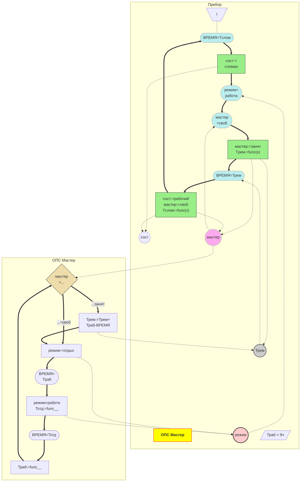

```mermaid

flowchart TD
    subgraph Прибор
        title[<b>Блок ПРИБОР</b>]
        h1(["BPEMЯ=Tслом"])==> h2["сост:=<br>сломан"]
        h2 ==> h3(["режим=<br>работа"])
        h3 ==> h4(["мастер<br>=своб"])
        h4 ==> h5["мастер:=занят<br>Tрем:=funс(x)"]
        h5 ==> h6(["ВРЕМЯ=Трем"])
        h6 ==> h7["сост:=рабочий<br>мастер:=своб<br>Tслом:=func(x)"]
        h7 ==> h1
        h2 -.->par3((сост))
        h7 -.->par3
        par1((режим))-.->h3
        par2((мастер))-.->h4
        h5 -.->par2
        h7 -.->par2
        h5 -.->par4((Трем))
        par4 -.-> h6
        p99[\I/] -.- h1
        h99[/"Тслом = 100ч"\]
    end

    subgraph ОПС Мастер
    title[<b>ОПС Мастер</b>]
        h10["режим:=отдых"] ==> h11(["ВРЕМЯ=<br>Tраб"])
        h11 ==> h12["режим=работа<br>Тотд:=func__"]
        h12 ==> h13(["ВРЕМЯ=Тотд"])
        h13 ==> h14["Траб:=func__"]
        h14 ==> h15{"мастер<br>=..."}
        h15 ==> |"...занят"| h16["Трем:=Трем+<br>Траб-ВРЕМЯ"]
        h15 ==> |"...=своб"|h10
        h16 ==> h10
        
        h99[/"Траб = 9ч"/]
        h16 -.-> par4((Трем))
        h10 -.-> par1((режим))
        h12 -.-> par1((режим))
        par2((мастер)) -.-> h15
        click par2 href "https://iu5.bmstu.ru" "переход для Мастера" _blank;
    end

classDef cond fill:#bee,stroke:#aaa,stroke-width:1px;
classDef state fill:#9e8,stroke:#333,stroke-width:1px;
class h5,h8,h2,h7,h100,h102,h104 state; 
class h1,h3,h4,h6,h101,h103 cond;
style title fill:yellow,stroke:red;
style par1 fill:#fcc,stroke:#111,stroke-width:2px;
style par2 fill:#fae,stroke:#bbb,stroke-width:2px;
style par4 fill:#ccc,stroke:#555,stroke-width:2px;
classDef navig fill:#eda,stroke:#333,stroke-width:1px;
class h15 navig;
```
