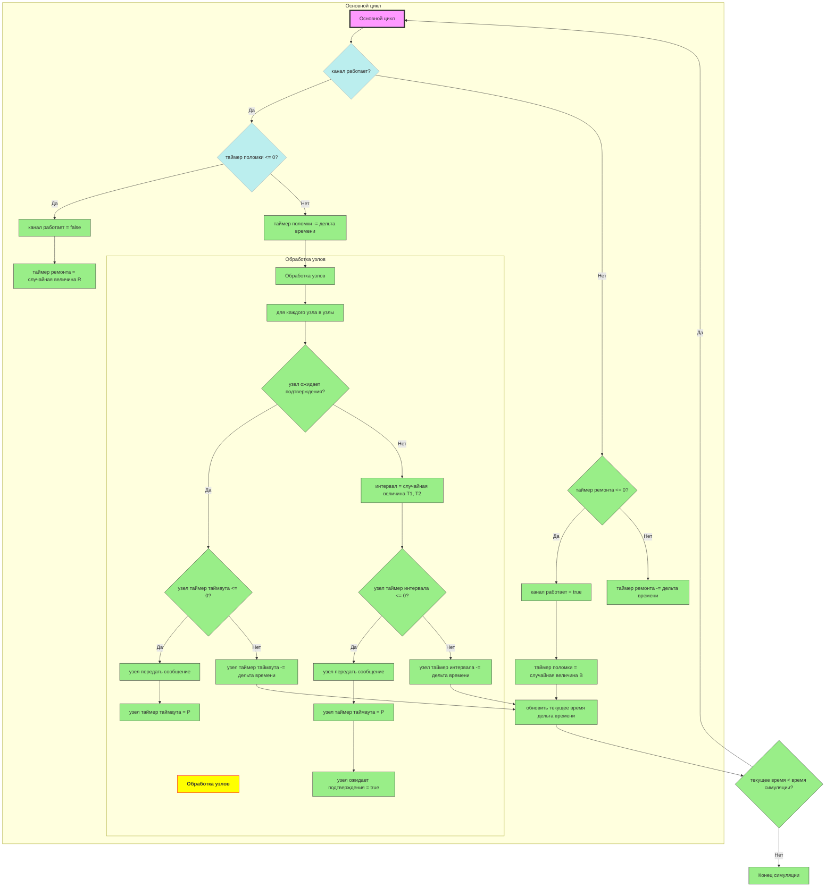

```mermaid

flowchart TD
    subgraph Основной цикл
        direction TB
        title[<b>Основной цикл</b>]
        F[Основной цикл] --> G{канал работает?}
        G -->|Да| H{таймер поломки <= 0?}
        H -->|Да| I[канал работает = false]
        I --> J[таймер ремонта = случайная величина R]
        H -->|Нет| K[таймер поломки -= дельта времени]

        G -->|Нет| L{таймер ремонта <= 0?}
        L -->|Да| M[канал работает = true]
        M --> N[таймер поломки = случайная величина B]
        L -->|Нет| O[таймер ремонта -= дельта времени]

        K --> P[Обработка узлов]
        subgraph Обработка узлов
            direction TB
            title[<b>Обработка узлов</b>]
            P --> Q[для каждого узла в узлы]
            Q --> R{узел ожидает подтверждения?}
            R -->|Да| S{узел таймер таймаута <= 0?}
            S -->|Да| T[узел передать сообщение]
            T --> U[узел таймер таймаута = P]
            S -->|Нет| V[узел таймер таймаута -= дельта времени]

            R -->|Нет| W[интервал = случайная величина T1, T2]
            W --> X{узел таймер интервала <= 0?}
            X -->|Да| Y[узел передать сообщение]
            Y --> Z[узел таймер таймаута = P]
            Z --> AA[узел ожидает подтверждения = true]
            X -->|Нет| AB[узел таймер интервала -= дельта времени]
        end

        N & AB & V --> AC[обновить текущее время дельта времени]
    end

    AC --> AD{текущее время < время симуляции?}
    AD -->|Да| F
    AD -->|Нет| AE[Конец симуляции]

    style F fill:#f9f,stroke:#333,stroke-width:4px;
    classDef cond fill:#bee,stroke:#aaa,stroke-width:1px;
    classDef state fill:#9e8,stroke:#333,stroke-width:1px;
    class I,J,K,L,M,N,O,P,Q,R,S,T,U,V,W,X,Y,Z,AA,AB,AC,AD,AE state;
    class G,H cond;
    style title fill:yellow,stroke:red;

```
